# GCEのVMインスタンス操作例
ここでは、Linuxインスタンスの一例として、GCEのVMインスタンスを生成または削除する手順を説明します。

下記の例では2023年8月3日時点でAlways freeの条件を満たすインスタンスを使用しますが、設定方法、使用方法、またはGCPの仕様変更により課金対象になる可能性があります。

## Googleアカウントの準備
GCPを使用するためのGoogleアカウントを用意し、まだ行っていない場合はGoogle Cloud Platformの利用開始手続きをします。
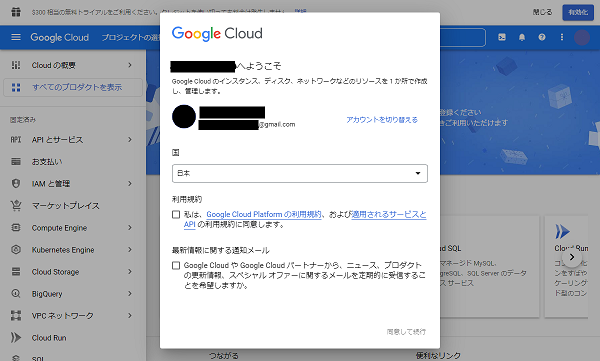

GCP利用開始には、次のようなアカウント情報設定と支払い方法の登録が必要です。

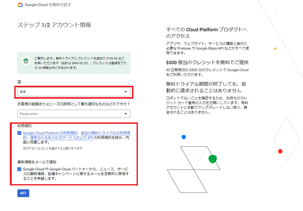  
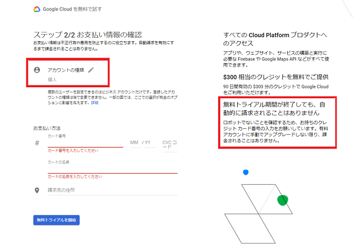

`gcloud`をDockerで使用する場合、次のように使用するGoogleアカウントの認証を行います。
```bash
docker run -ti --name gcloud-config gcr.io/google.com/cloudsdktool/google-cloud-cli gcloud auth login
```
リンクが出るので、Googleアカウントにログインできるブラウザに貼り付けます。
ログイン後、内容を確認して「許可」を押します。
`Enter the following verification code ...`という文章の下に認証コードが表示されるので、コピーしてCLIの方に貼り付けます。
成功すると、`gcloud-config`のコンテナ内に認証情報が保存されます。`gcloud-config`のコンテナは起動したままにして、以降の操作を行います。

## プロジェクトの作成または選択
プロジェクトを作成、または選択します。

### Google Cloud コンソールによる手順
左上の Google Cloud のロゴの右のボタンを押すと、「プロジェクトの選択」ダイアログが出るので、プロジェクトを選択し、「開く」を押します。

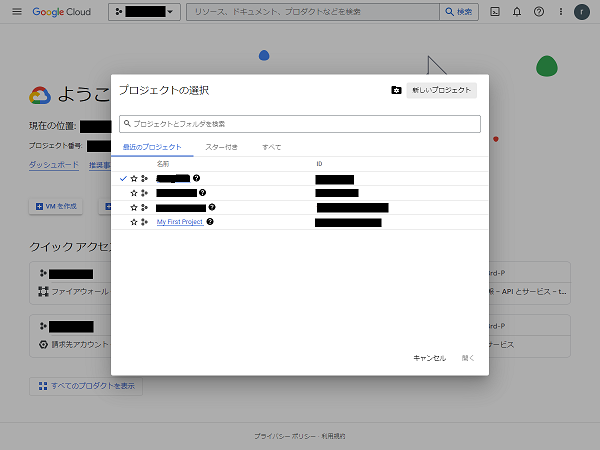  

同ダイアログの右上の「新しいプロジェクト」からプロジェクトを作成することができます。

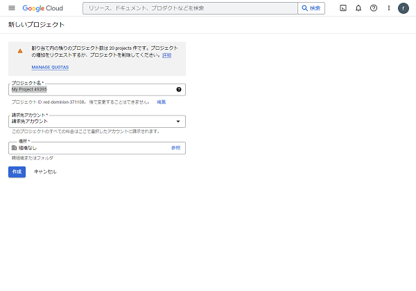  


### gcloudによる手順
操作対象にするプロジェクトを新規作成する場合、次のようにプロジェクトを作成します。既にプロジェクトが存在する場合はこの工程はスキップします。
```bash
docker run --rm --volumes-from gcloud-config gcr.io/google.com/cloudsdktool/google-cloud-cli \
  gcloud projects create example-project
```

次のように操作対象にするプロジェクトを選択します。
```bash
docker run --rm --volumes-from gcloud-config gcr.io/google.com/cloudsdktool/google-cloud-cli \
  gcloud config set project example-project
```
プロジェクト名の文字列は小文字になるので注意してください。

## 外部IPアドレスの取得とGCE VMインスタンスの生成
### Google Cloud コンソールによる手順
「VM インスタンス」のページから「インスタンスを作成」を押します。

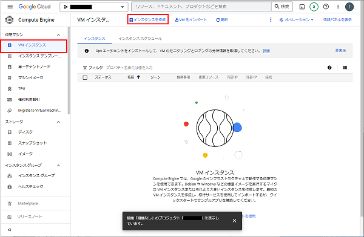  

インスタンス名、リージョン、ゾーン、シリーズ、マシンタイプの設定を行います。

- 参考として、2022/12/21 時点では、以下のリージョンでAlways freeのインスタンスが生成可能です。
  - リージョン
    - us-central1 アイオワ  
    - us-west1 オレゴン  
    - us-east1 サウスカロライナ  
  - ゾーン  
    - どれでも良い  
  - シリーズ、マシンタイプ  
      - E2、e2-micro  

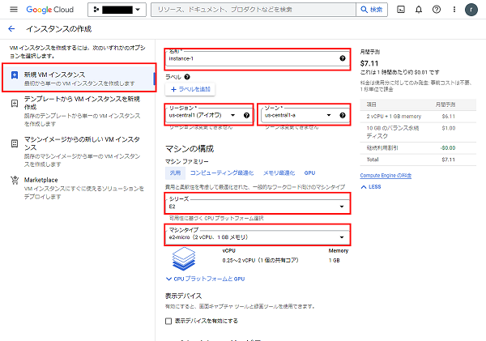  

「ブートディスク」の「変更」を押して、ブートディスクの設定変更ができます。

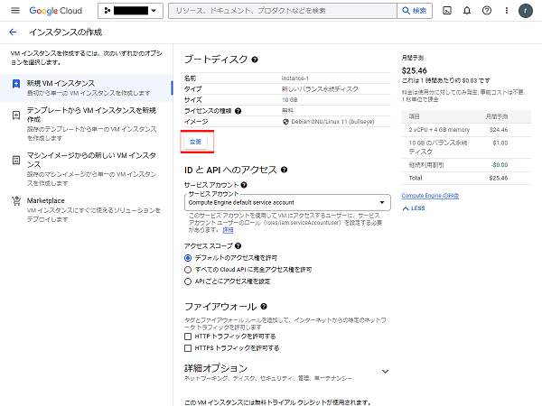  

OSをUbuntu, バージョンは20.04 LTSを指定します。
2022/12/21 時点のAlways free条件ではブートディスクの種類は標準永続ディスク、30GBまでとする必要があります。

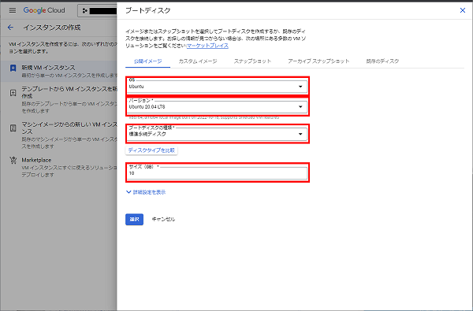  

「ファイアウォール」の項目でHTTPトラフィックとHTTPSトラフィックを許可するようチェックを入れます。

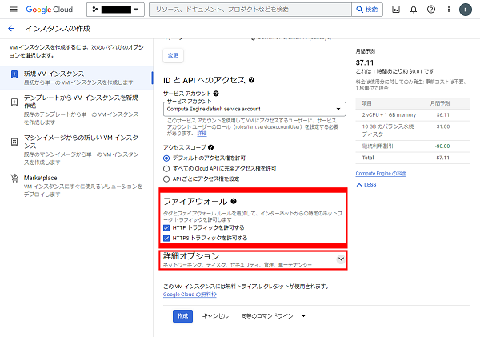  

「詳細オプション」→「ネットワーキング」を展開し、「外部IPv4 アドレス」を選択し、「静的外部 IP アドレスを予約」を選択、「名前」に適当なIPアドレスの名前を入力し、「予約」を押します。

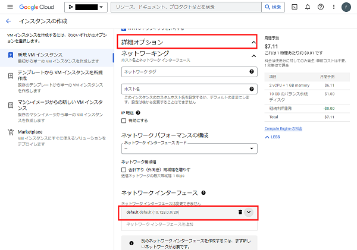  
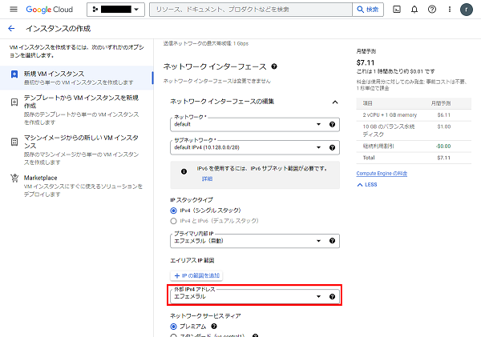  
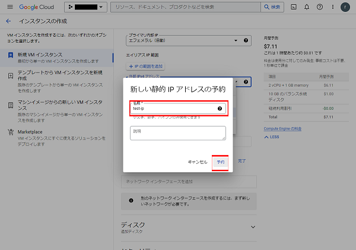

「ネットワーク サービス ティア」は「プレミアム」が2022/12/21 時点のAlways freeの条件となります。

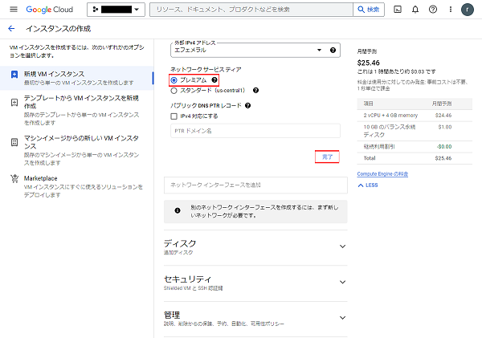  

「作成」ボタンを押すとVMマシンが作成されます。

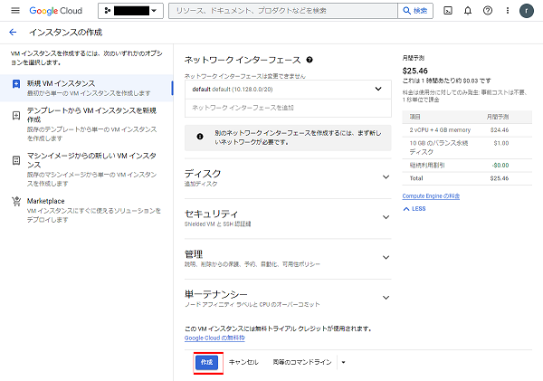  

### gcloudによる手順
外部IPアドレスを取得します。
```bash
docker run --rm --volumes-from gcloud-config gcr.io/google.com/cloudsdktool/google-cloud-cli \
  gcloud compute addresses create instance-external-ip --network-tier=PREMIUM --region=us-west1
```

取得した外部IPアドレスを使用し、インスタンスを生成します。
```bash
docker run --rm --volumes-from gcloud-config gcr.io/google.com/cloudsdktool/google-cloud-cli \
  gcloud compute instances create instance-1 --machine-type e2-micro --zone us-west1-b \
  --boot-disk-type=pd-standard --boot-disk-size=10GB \
  --image-project ubuntu-os-cloud --image-family=ubuntu-2004-lts \
  --tags http-server,https-server --network-interface=address=instance-external-ip
```
```
WARNING: You have selected a disk size of under [200GB]. This may result in poor I/O performance. For more information, see: https://developers.google.com/compute/docs/disks#performance.
Created [https://www.googleapis.com/compute/v1/projects/example-project/zones/us-west1-b/instances/instance-1].
NAME        ZONE        MACHINE_TYPE  PREEMPTIBLE  INTERNAL_IP  EXTERNAL_IP     STATUS
instance-1  us-west1-b  e2-micro                   10.138.0.3   35.199.152.206  RUNNING
```

## Dockerをインストール
VMインスタンスでdockerが使えるようにします。
VMインスタンスにSSHでブラウザでログインし、`install_docker.sh`をアップロードします。
その後、
```bash
sudo bash script/GoogleCloudConsole/install_docker.sh
```
でインストールを実行します。

ログインユーザを`docker`グループに追加 (dockerをどのユーザで実行するかによる、要検討)します。
```
sudo usermod -a -G docker <ユーザ名>
```
この後dockerを使用する場合は、一度ログアウトしてログインし直してください。

## VMインスタンスの削除
### Google Cloud コンソールによる手順
「VM インスタンス」のページで対象VMをチェックし、「削除」を押します。

### gcloudによる手順
次のようにVMインスタンスを削除します。`--zone`の特定は必須です。
```bash
$ docker run --rm --volumes-from gcloud-config gcr.io/google.com/cloudsdktool/google-cloud-cli \
  gcloud compute instances delete instance-1 --zone us-west1-b
The following instances will be deleted. Any attached disks configured to be
auto-deleted will be deleted unless they are attached to any other instances or
the `--keep-disks` flag is given and specifies them for keeping. Deleting a disk
 is irreversible and any data on the disk will be lost.
 - [instance-1] in [us-west1-b]

Do you want to continue (Y/n)?
Y
Deleted [https://www.googleapis.com/compute/v1/projects/example-project/zones/us-west1-b/instances/instance-1].
```

## 外部IPアドレスの解放
### Google Cloud コンソールによる手順
「VPC ネットワーク」→「IP アドレス」のページで対象の外部IPアドレスの行の右にある三点リーダを押し、「別リソースに再割り当て」を押し、「接続先」で「なし」を選択し、'OK' を押します。割り当てていたインスタンスを削除している場合は最初から「なし」になっている場合があります。

次に削除する外部IPアドレスをチェックし、「静的アドレスを解放」を押します。

### gcloudによる手順
取得しているIPアドレス一覧取得を確認します。
```bash
$ docker run --rm --volumes-from gcloud-config gcr.io/google.com/cloudsdktool/google-cloud-cli \
  gcloud compute addresses list
NAME                       ADDRESS/RANGE   TYPE      PURPOSE  NETWORK  REGION    SUBNET  STATUS
instance-external-ip  35.203.130.244  EXTERNAL                    us-west1          RESERVED
```
削除したVMのアドレスの`NAME`および`REGION`を確認します。

削除対象のIPアドレス削除および解放します。`--region`の指定は必須です。
```bash
$ docker run --rm --volumes-from gcloud-config gcr.io/google.com/cloudsdktool/google-cloud-cli \
  gcloud compute addresses delete instance-external-ip --region us-west1
The following addresses will be deleted:
 - [instance-external-ip] in [us-west1]

Do you want to continue (Y/n)?
Y
Deleted [https://www.googleapis.com/compute/v1/projects/example-project/regions/us-west1/addresses/instance-external-ip].
```
