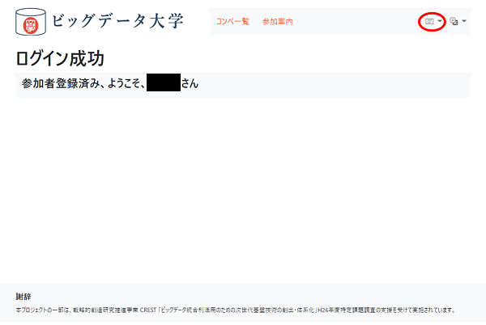
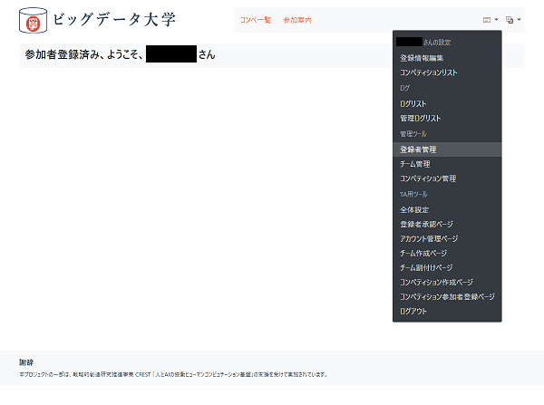
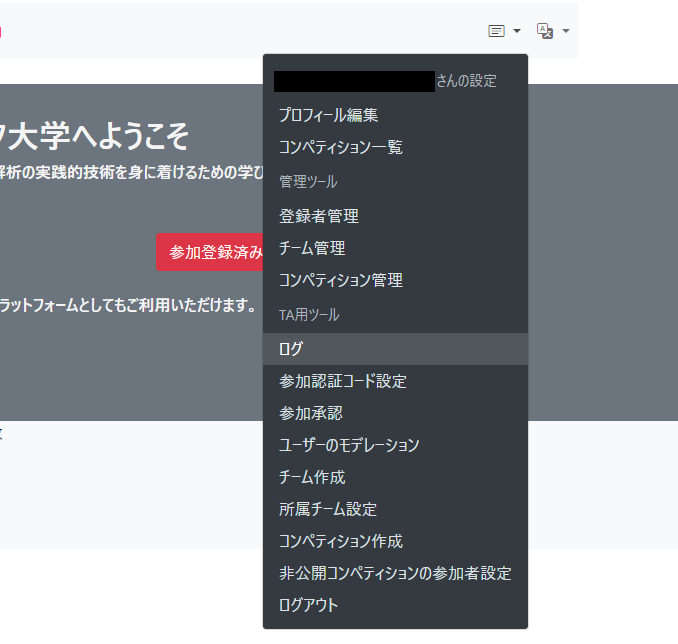
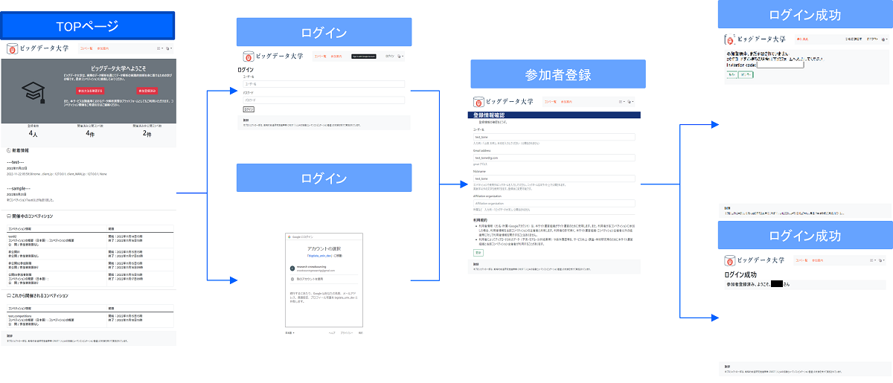
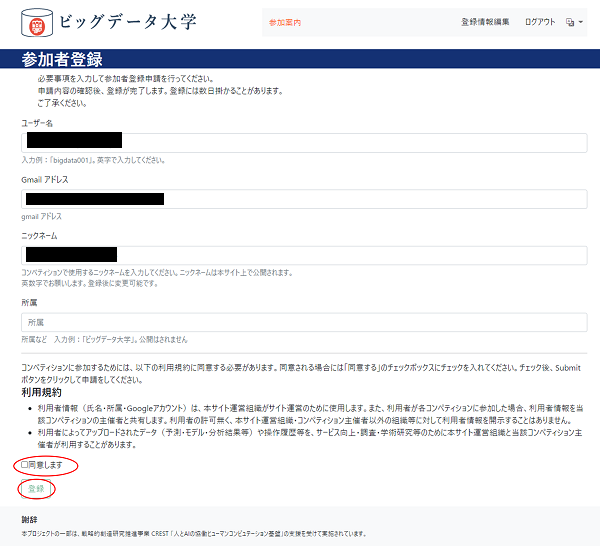
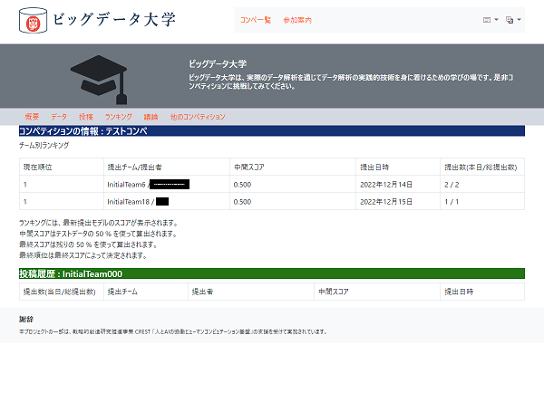
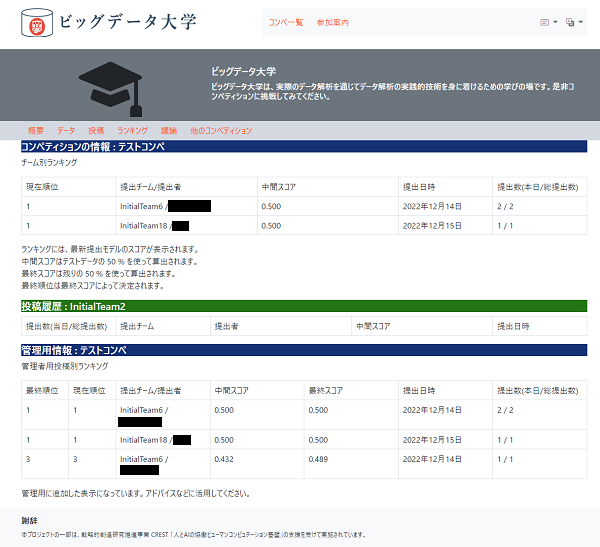
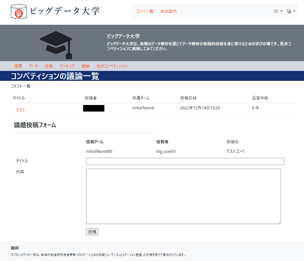
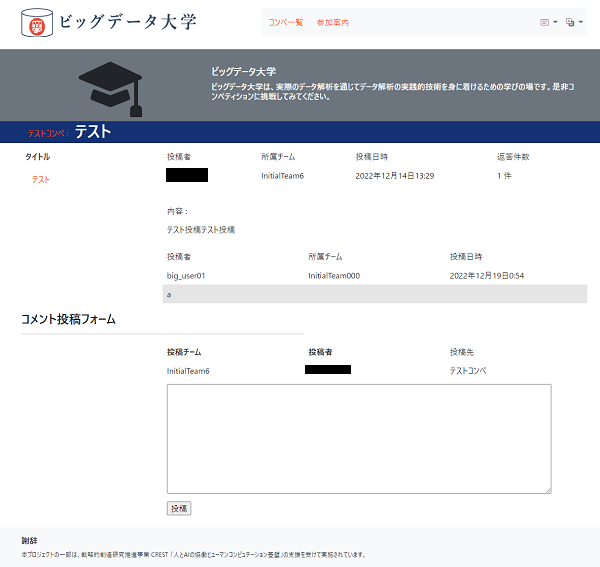

# アプリの操作方法
ここでは、アプリケーションの操作方法を説明します。

  

## 管理者の操作
### 初回ログイン
初回アクセス時に管理者ユーザにログインし、管理者ユーザの設定を行ってください。

1. 右上の「ログイン」を押します。<br>
    <br>
1. [環境変数設定ファイル `.env`](README.md#設定ファイルの作成)の `DJANGO_SUPERUSER_USERNAME` で指定した管理者ユーザ名と `DJANGO_SUPERUSER_PASSWORD` で指定したパスワードを入力しログインします。<br>
    <br>
1. 利用規約への同意をチェックし、「登録」を押します。<br>
    <br>

### ユーザの手動追加
Google OAuth2 クライアントを使用する場合、ユーザはGoogleアカウントでログインすることにより自動で作成されます。
TAユーザを作成する場合や、管理者が手動でユーザを追加するには次の手順を行ってください。

1. 管理者ユーザでログインし、メニューアイコンを押下します。<br>
    <br>
1. 「登録者管理」を選択します。<br>
    <br>
1. 「ユーザーを追加」をクリック。<br>
    <br>
1. ユーザ名 、Gmailアドレス、ニックネーム、パスワードを入力。<br>
    <br>
1. チームを選択または作成します。
  - チームを作成する場合はチームの横の'+'ボタンを押下し、任意の名前を入れて「保存」を押します。新規作成したチーム名を`SelectedTeam`で選択可能にするには、「保存して編集を続ける」を押してください。<br>
    <br>
1. 「保存」でユーザを作成します。「下記のエラーを修正してください。」と出る場合は該当箇所の入力の修正を行い、再度「保存」を押してください。
1. 左のメニューの「ユーザー」を選択し、作成したユーザのメールアドレスを選択してください。
  - TAユーザにする場合、「操作権限」の項目の「スタッフ」と「参加者」にチェックを付け、「グループ」で「TA」を選択し、「→」ボタンを押して「選択されたグループ」に「TA」があることを確認します。<br>
  <br>
  - 一般の参加者ユーザにする場合、「操作権限」の項目の「参加者」にチェックを付け、「グループ」で「Participant」を選択し、「→」ボタンを押して「選択されたグループ」に「Participant」があることを確認します。<br>
1. ページ右下の「保存」ボタンを押し、設定を完了します。
1. 作成したユーザの初回ログインではInvitation codeが求められます。初期状態のInvitation codeは `XYZxyz095` です。
    <br>

初期状態で `TA` と `Participant` のグループが定義されています。各グループの権限は次のようになります。

* グループ `TA` の権限 (TA用)

  |App名|項目|権限|  
  |---|---|---|  
  | accounts | チーム　| Add |  
  | accounts | チーム　| Change |  
  | accounts | チーム　| View |  
  | accounts | ユーザー　| Change |  
  | accounts | ユーザー　| View |  
  | competitions | コンペティション | Add |  
  | competitions | コンペティション | Change |  
  | competitions | コンペティション | View |  
  | competitions | コンペティション投稿データ | Add |  
  | competitions | コンペティション投稿データ | Change |  
  | competitions | コンペティション投稿データ | View |  

* グループ `Participant` の権限 (参加者用)

  |App名|項目|権限|  
  |---|---|---|  
  | accounts | チーム　| View |  
  | competitions | コンペティション | View |  
  | competitions | コンペティション投稿データ | Add |  
  | competitions | コンペティション投稿データ | Change |  
  | competitions | コンペティション投稿データ | View |  

Django 管理サイトの左下の「グループ」を押してグループ管理ページを開き、右上の「グループを追加」で任意の名前、権限のグループを作成することができます。

### チーム作成
TAまたは管理者ユーザのナビメニューの「チーム作成」をクリックして表示されるページで 'Name:' の欄にチーム名を入力し「作成」ボタンを押すとチームを作成することができます。

### ユーザの所属チーム設定
ユーザをチームに所属させるには、ナビメニューの「所属チーム設定」を選択し、プルダウンからチームを選択し、所属させるユーザをチェックボックスで選択し、「更新」を押して反映させます。


### Invitation codeの設定
TAまたは管理者ユーザのメニューの「全体設定」を選択して表示されるページの 'Authentication code:'の欄に変更後のInvitation codeを入力し、「更新」ボタンを押します。

### コンペティションの作成
管理者ユーザまたはTAグループのユーザでログインし、次の手順でコンペティションを新規作成できます。

1. 「コンペティション作成ページ」を開きます。<br>
<br>
1. コンペティション情報の記入をします。`(optional)`が付く項目以外は必須項目です。<br>
<br>
1. 下にある「作成」ボタンを押すとコンペティションが作成されます。
1. 「コンペ一覧」またはメニューにある「コンペティションリスト」からコンペ一覧ページを開き、作成したコンペティションの情報を確認してください。<br>
<br>

注意点として、コンペ作成手続きを行っても必ずしもすぐには状態が反映されず、10分毎にコンペティション情報が最新の状態に更新されます。

> コンペティションの状態更新頻度はデフォルトでは10分ですが、`entrypoint.sh` を編集することで変更が可能です。
> 
> 更新頻度を変えるには `python manage.py runapscheduler` の行を次の書式で編集します。
> ```
> python manage.py runapscheduler \
> --year "<4桁の年>" \
> --month "<月 (1-12)>" \
> --day "<日にち (1-31)>" \
> --week "<週 (1-53)>" \
> --day_of_week "<曜日 (0-6 or mon,tue,wed,thu,fri,sat,sun)>" \
> --hour "<時間 (0-23)>" \
> --minute "<分 (0-59)>" \
> --second "<秒 (0-59)>" \
> ```
> これらの引数は [apscheduler.triggers.cron.CronTrigger](https://apscheduler.readthedocs.io/en/3.x/modules/triggers/cron.html#apscheduler.triggers.cron.CronTrigger) に渡されます。
> `--hour "*/2" --minute "0" --second "0"` とすると2時間ごと0分0秒時点、`--hour "5-7"` とすると5時～7時の0分0秒時点など[UNIX Cronの書式](https://ja.wikipedia.org/wiki/Cron#%E5%BC%8F)で記述することができます。値はダブルクォーテーション `""` で囲むようにしてください。編集後、コンテナを再起動してください。

コンペティション作成により、トップページ、コンペティション一覧ページ、管理ログ、コンペティションページが更新されます。


### ログの確認
ユーザーの活動やコンペ進行のログを確認することができます。
管理者、スタッフ権限で利用可能です。

<br>

ログビュアーではユーザーのアクセス記録、投稿、コンペティションの開始、終了の記録などを確認できます。<br>


## 一般ユーザの操作
### アカウント有効化 



Googleアカウントでログインする場合、`Sign in with Google Account`のボタンを押し、Googleにログインします (Google OAuth2クライアントを使用するインスタンスのみ)。<br>
<br>
Googleアカウントによるログインを行わない場合には、[Django 管理ページからユーザを作成する](#ユーザの追加)必要があります。

初回ログインでは、参加規約が表示され「同意します」にチェックし「登録」ボタンを押す必要があります。<br>  
<br>  
Invitation codeを入力します<br>  
<br>

初回ログイン後の再ログインも同様に `Sign in with Google Account` のボタンからGoogleアカウントへログインすることでログインできます。その際に「登録情報確認」ページが表示されます。変更がある場合は編集して「更新」ボタンを押し、変更が無い場合はページ上部メニューから別のページへ遷移するか、「変更なし」を押します。

認証コードを使わない場合、TAまたは管理者による参加資格付与が必要です。その際、次のように対象参加者ユーザの情報を編集する必要があります。
1. メニューの「登録者承認ページ」を選択、対象ユーザの「参加認証」のチェックボックスをチェックし、「承認」をボタンを押し、参加資格を付与します。
1. メニューの「チームの割付け」を選択、対象ユーザを割り当てるチームを選択し、「更新」ボタンを押します。
    - 自動割付を有効にしている場合、自動でチームが割り付けられます


## コンペティション関連ページ
1つのコンペティションに対して、概要、データ、投稿、ランキング、議論のページがあります。


### 概要ページ
コンペティションの概要、基本情報が記載されています。
参加制限の場合、参加者のみ閲覧できます。


### データページ
データの情報とダウンロードを行うページです。参加者のみ閲覧できます。
表示される投稿規約への同意にチェックし、かつコンペティション開催期間中のみデータをダウンロード可能です。


### 投稿ページ
予測結果を投稿するページです。参加者のみに閲覧可能です。


### ランキングページ
参加チームごとの中間順位を表示します。参加者のみ閲覧可能です。

参加者には所属チームの投稿履歴が表示されます。



管理者には投稿ごとのランキングが表示されます。



コンペティション終了後は最終の順位が表示されます。

### 議論ページ
コンペティションに関する議論の議題投稿を行うページです。



議題を選択すると、その議題に対するコメント投稿ページが表示されます。


