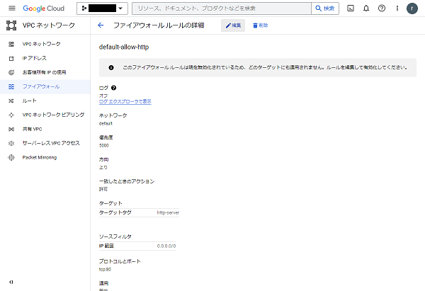
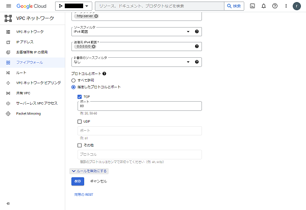
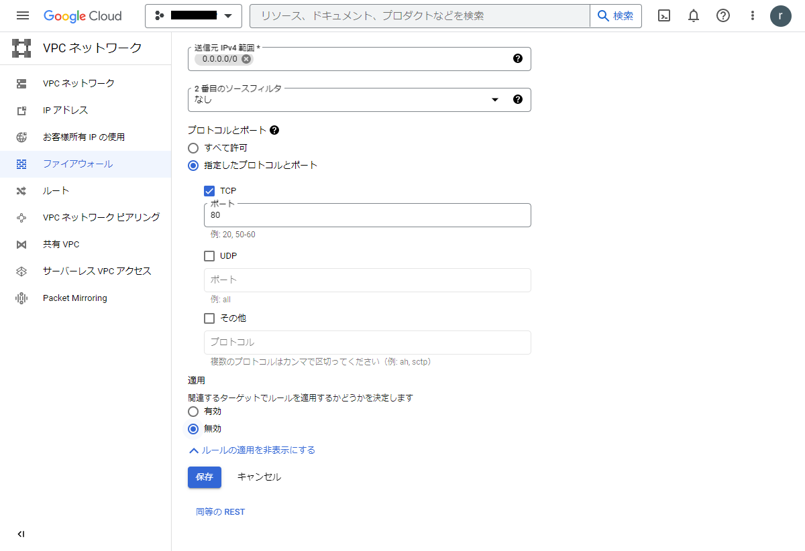
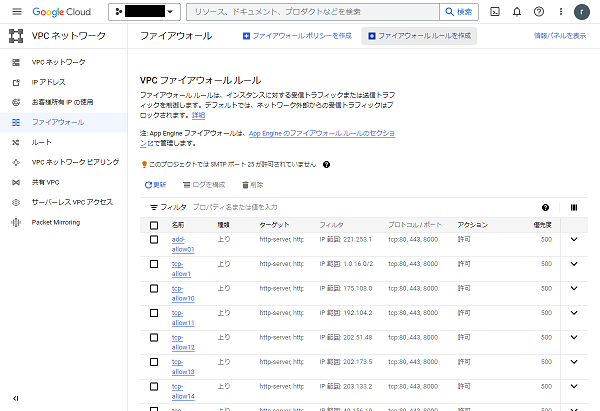
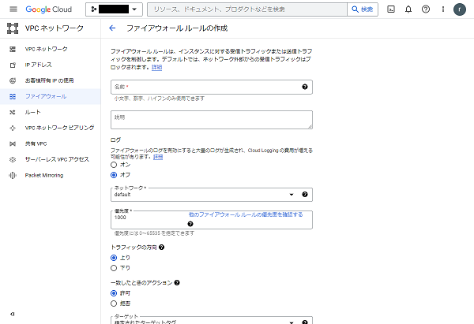
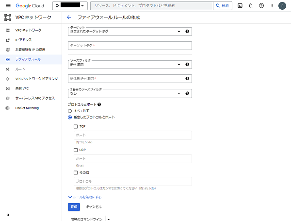

# ファイアウォール設定例
固定IPアドレスを設定して立ち上げたインスタンスはインターネット上から不特定多数のアクセスが行われるため、ファイアウォールを適切に設定することが推奨されます。

ここでは、GCPでのファイアウォール設定の例を説明します。

GCPコンソールの左のメニューの「VPC ネットワーク」→「ファイアウォール」を選択し、ファイアウォールの設定画面を開きます。

  

執筆時点での初期ルールは次のようになっています。

|名称|種類|ターゲット|フィルタ|プロトコル、ポート|アクション|  
|:---:|:---:|:---:|:---:|:---:|:---:|  
|default-allow-http|上り|http-server|IP 範囲: 0.0.0.0/0|tcp:80|許可|  
|default-allow-https|上り|https-server|IP 範囲: 0.0.0.0/0|tcp:443|許可|  
|default-allow-icmp|上り|all|IP 範囲: 0.0.0.0/0|icmp|許可|  
|default-allow-rdp|上り|all|IP 範囲: 0.0.0.0/0|tcp:3389|許可|  
|default-allow-ssh|上り|all|IP 範囲: 0.0.0.0/0|tcp:22|許可|  
|default-allow-internal|上り|all|10.128.0.0/9|tcp:0-65535,udp:0-65535,icmp|許可|  

以下の設定では、次のようにアクセスを制限します。
- Webアプリケーションの公開範囲を日本のみに制限するため、全世界公開のhttp,httpsを制限  
- sshの22ポートも全世界からのアクセスを取り下げる  

まず、次のルールを無効化します。
|名称|種類|ターゲット|フィルタ|プロトコル、ポート|アクション|  
|:---:|:---:|:---:|:---:|:---:|:---:|  
|default-allow-http|上り|http-server|IP 範囲: 0.0.0.0/0|tcp:80|許可|  
|default-allow-https|上り|https-server|IP 範囲: 0.0.0.0/0|tcp:443|許可|  
|default-allow-ssh|上り|all|IP 範囲: 0.0.0.0/0|tcp:22|許可|  

上記3つのルールに対して、次の手順を繰り返して無効化します。
1. 停止するルールの名前をクリックし詳細画面に移動します。
1. 編集ボタンを押します。<br>
      
1. 詳細の下の方にある「ルールを無効にする」タブをクリックし展開します。
1. 展開して現れる「無効」のチェックボックスを選択して「保存」します。<br>
      
      

次のルールを追加し、Googleシステムからのアクセスを許可します。

|名称|種類|ターゲット|フィルタ|プロトコル、ポート|アクション|  
|:---:|:---:|:---:|:---:|:---:|:---:|  
|allow-ingress-from-iap|上り|(ネットワーク上のすべてのインスタンス)|35.235.240.0/20|tcp:22,3389|許可|  

1. 「ファイアウォールルールを作成」をクリックして、作成ウィザードを出します。<br>
      
1. 名前を入力し、上の表にある内容を入力や選択します。
1. 「生成」ボタンを押します。<br>
      
      

日本からのみのアクセスに制限するルールを追加する方法を次に示します。
日本からのみのアクセスに制限するため [日本[jp]に割り振りされたIPアドレスの一覧 - fetus](https://ipv4.fetus.jp/jp) を参考にします。自動で適用するスクリプトを用意しています。

|名称|種類|ターゲット|フィルタ|プロトコル、ポート|アクション|  
|:---:|:---:|:---:|:---:|:---:|:---:|  
|tcp-allowX|上り|http-server,https-server|指定範囲|tcp:80,443,8000|許可|  

まず、VMインスタンスで`gcloud`でログインします。
```bash
gcloud auth login
```
出力されたリンクをGoogleアカウントにログインできるブラウザに貼り付け、認証コードをコピーしてログインを完了します。

`script/GoogleCloudConsole/firewall.tar` を解凍し、実行します。
```shell
cd script/GoogleCloudConsole
tar xvf firewall.tar  
cd firewall
bash catdata.sh
bash makerules.sh
```


gcloudの実行について確認されるので、「承認」を押します


次のように処理状況が表示されます。


各スクリプトは次のような処理内容です。
- `catdata.sh`: IPアドレス指定を250行で切り出す処理  
    ```catdata.sh
    #!/bin/sh
    wget https://ipv4.fetus.jp/jp.txt
    bash catcommentout.sh > ip_list.txt
    sed -i '/^$/d' ip_list.txt
    cat ip_list.txt | awk 'NR%250 != 0{printf "%s ", $1} NR%200 == 0 {printf "%s\n",$1}' | sed -e s/" "/,/g> ip_list2.txt
    ```
- `catcommentout.sh`: IPアドレスリストから不要な行を削除する処理  
    ```catcommentout.sh
    #!/bin/sh
    while read NAME ;do
    # コメント行除外
    echo $NAME | grep -v '^#.*' > /dev/null
    if [ $? -eq 0 ];then
        echo "$NAME"
    fi
    done < ./jp.txt
    ```
- `makerule.sh`: ファイアウォールのルールを生成するコマンド  
    ```makerule.sh
    #!/bin/sh
    i=0
    while read line
    do
    i=$(expr $i + 1)
    gcloud compute firewall-rules create tcp-allow$i --action=ALLOW --rules=tcp:80,tcp:443,tcp:8000 --direction=INGRESS --priority=500 --no-enable-logging --target-tags=http-server,https-server --source-ranges=$line
    done < ./ip_list2.txt
    ```

追加されたルールは次のようになります。

  

ただし、携帯電話などIPアドレスがリストから漏れている場合もあり、必ずしも日本国内のIPアドレスから繋げない場合があります。
コンペティションで参加者が使用する環境からアクセスできることを確認してください。

注意すべきこととして、ここでの設定例はLet's EncryptによるTLS (SSL)証明書を発行することを想定しない場合の設定です。
Let's Encryptで証明書を発行する際には、[HTTP-01 チャレンジ](https://letsencrypt.org/ja/docs/challenge-types/) (ACMEチャレンジ)を成立させるために国外のサーバとの通信が必要となりますので、ここで紹介したような国内にアクセスを限定するファイアウォールは無効化する必要があります。
具体的には上記手順の始めに無効化した default-allow-http および default-allow-https を有効化する必要があります (その場合、国内に限定するルールの意味がなくなります)。
