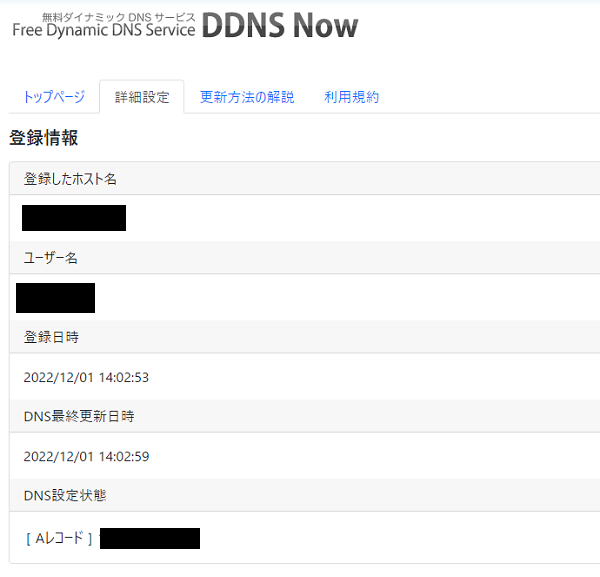

# ドメイン名取得の例
ここでは、ドメイン名を取得する方法の一例として、[DDNSnow](https://ddns.kuku.lu/)のサブドメイン名取得の方法を紹介します。

新規登録でユーザ名 (ユーザ名+`.f5.si`がドメイン名になる)を指定し、重複していなければ取得できます。

  

ログイン後、「詳細設定」の「Aレコード(IPv4アドレス)」にインスタンスが稼動する外部IPアドレスを入力し、下の「設定を更新する」を押します。

