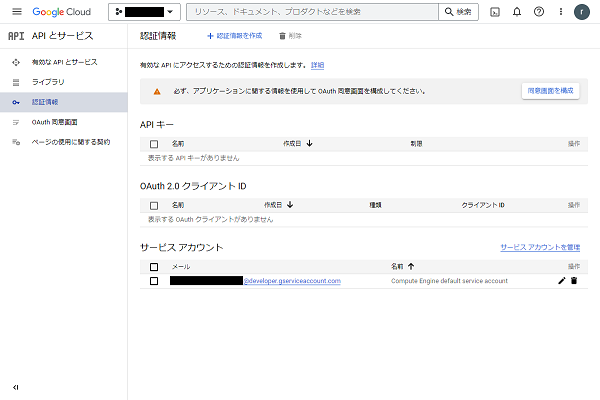

# Google OAuth2クライアント設定
ここでは、Google OAuth 2.0 の仕組みを用いたソーシャル認証のサーバー側の設定方法を説明します。

## GCPの設定手順
1. GCPコンソールの左メニューの「APIとサービス」→「認証情報」を選択します。<br>
      
1. 「認証情報を作成」→「OAuth クライアントID」を選択、ウィザードに従って作成します。<br>
    
    1. 「同意画面を設定」を押します。<br>
        
    1. 「外部」を選択し「作成」を押します。<br>
          
    1. 「デベロッパーの連絡先情報」に窓口のメールアドレスを入力します (Google 認証時に問い合わせ先として表示されるため、公開時にはメール対応が必要です)。<br>
          
    1. 「保存して次へ」を押します。<br>
          
    1. 「保存して次へ」を押します。<br>
          
    1. 「ダッシュボードに戻る」を押します。<br>
        
2. OAuth クライアントID を作成します。
    1. 「アプリケーションの種類」で「ウェブアプリケーション」を選択します。<br>
        <br>
          
    1. 「承認済みのリダイレクトURI」に次のURIを追加します (`<ドメイン名>`を使用するドメイン名、SSL接続を使用しない場合は`https`を`http`に置換してください):
        - `https://<ドメイン名>/ja/social-auth/complete/google-oauth2/`
        - `https://<ドメイン名>/ja/oauth/complete/google-oauth2/`
        - `https://<ドメイン名>/en/social-auth/complete/google-oauth2/`
        - `https://<ドメイン名>/en/oauth/complete/google-oauth2/`
          
    1. 作成ボタンを押します。<br>
          
    1. 「クライアントID」と「クライアントシークレット」を控えるか、JSONをダウンロードして保管してください。

以上でGCP側設定完了で、反映まで5分ほどかかります。

### 注意点
この同意画面の項目の設定例ではテスト用にしています。
テスト設定の場合、設定が簡易な一方、100人までしか使えないため、ユーザが100人を超えないように注意してください。

## アプリ側の設定手順
環境変数にクライアントIDとクライアントシークレットを記入します。
`SOCIAL_AUTH_GOOGLE_OAUTH2_KEY` にクライアントID、`SOCIAL_AUTH_GOOGLE_OAUTH2_SECRET` にクライアントシークレットを代入します。

`.env`ファイルに次のように記入してください。
```
SOCIAL_AUTH_GOOGLE_OAUTH2_KEY=<Google OAuth2 のキー>
SOCIAL_AUTH_GOOGLE_OAUTH2_SECRET=<Google OAuth2 のシークレットキー>
```

`.env`を編集後、Dockerコンテナを再起動し、googleアカウントによりアクセスボタンで動作を確認してください。
